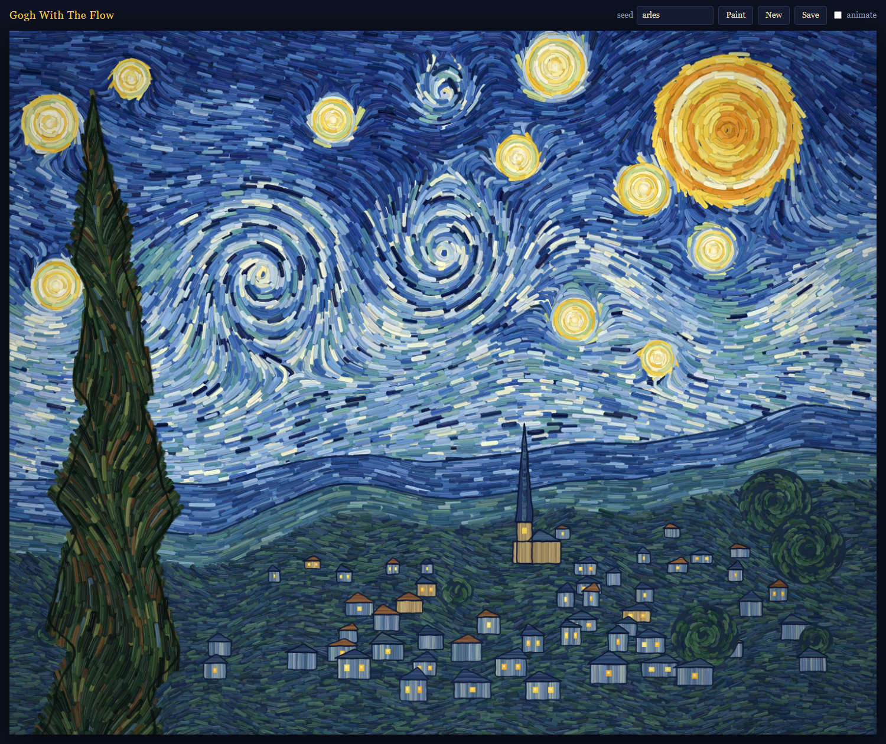

# GoghWithTheFlow

Procedurally generated paintings in the style of Van Gogh's *The Starry Night*, in the spirit of
[shan-shui-inf](https://github.com/LingDong-/shan-shui-inf). Every seed paints a new night: a
different swirling sky, scatter of stars, moon, hills, village and cypress.

## Run it

No build step and no dependencies. Open `index.html` in a browser.

- **seed**: type any text and press Enter or **Paint**. The same seed always gives the same painting.
- **New**: a random seed.
- **Save**: download the canvas as a PNG.
- **animate**: watch it get painted stroke by stroke.

URL parameters: `?seed=arles` picks a seed, and `&animate=0` renders instantly.

## How it works

Everything is plain canvas 2D, made of tens of thousands of thick brush strokes.

| File | What it paints |
| --- | --- |
| `js/util.js` | Seeded RNG, Perlin noise, color helpers |
| `js/brush.js` | Impasto stroke (shadow, body, bristle streaks, highlight) and flow-field tracing |
| `js/sky.js` | Vector field made of a base wave, a "milky way" ribbon, counter-rotating vortices (the great swirl) and tangential flow around each star and the moon; plus concentric halo rings |
| `js/land.js` | Noise ridgelines; strokes follow the ridge slope; dark outlines |
| `js/village.js` | Ground, houses with lit windows, church spire, round trees, drawn back to front |
| `js/cypress.js` | Flame-shaped silhouette with skewed-sine lobes; strokes flow upward and curl outward |
| `js/painting.js` | Lays out the scene from the seed and orders every stroke into a list of draw ops |
| `js/main.js` | UI and progressive rendering |

The scene is planned up front as an ordered list of draw operations, which is what makes the
painting-in-progress animation possible and keeps a seed fully deterministic.
