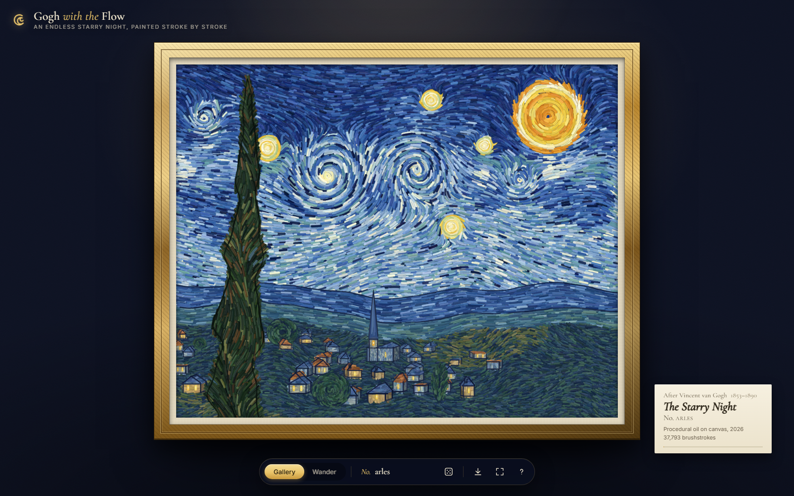
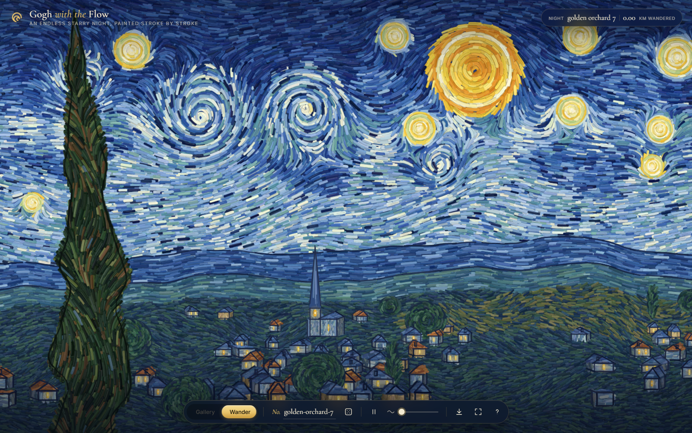

# Gogh with the Flow

An endless *Starry Night*, procedurally painted stroke by stroke. It takes its spirit from
[shan-shui-inf](https://github.com/LingDong-/shan-shui-inf), but works in Van Gogh's brush instead of ink.





## Two ways to look at it

- **Gallery**: a close reinterpretation of the 1889 painting, hung in a gilded frame on a museum
  wall, with a placard that names its seed and counts its brushstrokes. It has the flame-shaped
  cypress cluster, the rolling great swirl, eleven haloed stars, a crescent moon, mountains that
  climb to a dark peak on the right, olive groves, and a white church spire. Each seed varies the
  details slightly.
- **Wander**: walk sideways through an infinite night, starting from the gallery painting itself.
  The country changes as you go, through regions borrowed from other Van Gogh paintings:
  - **villages** with churches (spires, bell towers, domes), thatched cottages, tall townhouses and a glowing café, after *Café Terrace at Night*;
  - **wheat fields** with haystacks and lone cypresses, after *Wheatfield with Cypresses*;
  - **a river** lined with gaslights whose reflections shimmer in the water, after *Starry Night Over the Rhône*;
  - **olive orchards** planted in rows;
  - **windmill hills**, whose sails turn when the painting is alive;
  - **sunflower fields**, after the *Sunflowers* series, where bees drone among the heads;
  - **wheat under a storm**, after *Wheatfield with Crows*, with a heavy sky and crows circling and calling.

  Umbrella pines, poplars, irises and boats turn up along the way. Each stretch is painted just ahead of you.

**Every seed is different.** Each one picks a sky mood (classic, indigo, teal, violet or
stormy), a moon phase (crescent, half or full) and an order of regions. It also gets a season and a sky temperament. The gallery painting may
be mirrored, its stars and swirls shift, and it gets a landmark: a windmill on the hills, a
gaslit river, haystacks, a lit café, sunflowers in the foreground, or crows circling over the wheat (usually under a storm).

Turn on **life** (on by default) and the painting moves. Brush strokes stream along the same
currents that painted the sky, halos of paint circle the stars, the moon breathes, windows
flicker like candlelight, and every so often a shooting star crosses the night.

Every seed is its own night, and the same seed always paints the same world. Share a link and
your friend sees exactly your night.

## Sound, sky and postcards

- **Soundtrack** (`M`): generated live with Web Audio, nothing sampled. The seed sets the key and chord order; the sky's mood sets the scale; a music-box melody and a distant bell float over a slow pad. Regions have their own sounds that crossfade as you walk: crickets in the wheat and orchards, running water along the river, wind on the windmill hills, birds at dawn.
- **Sky and time of day**: each seed starts in a mood (classic, indigo, teal, violet, stormy, dawn, dusk, daylight, ember or aurora), and the sky drifts into a different one every few screens as you wander. In daylight the stars go out and the moon becomes a sun. Skies also differ in composition (the original two swirls, rolling waves, one great spiral, three spirals, a diagonal stream or a churn of small whorls), in temperament (calm, classic or turbulent) and in brushwork (fine dabs, the usual strokes or bold ribbons). The current mood and season show in the HUD.
- **Seasons and weather**: every night is in summer, spring (almond blossom and drifting petals), autumn (rust-coloured trees and falling leaves) or winter (snow on the ground and falling snow). Weather is rare: only about one stretch in six has anything falling, and it is rain, snow, petals or leaves to suit the season.
- **Postcards** (`S`): a dialog lets you pick a design (classic, museum, airmail or polaroid) and write a message in handwriting, with a live preview. The card carries the painting, its title and number, sky, season, moon, landmark or country, brushstroke count, a stamp and a postmark. `Shift+S` saves the plain image.
- **Foreground tree**: each seed picks a different silhouette for the big cypress on the near side of the gallery painting.

## On phones

Swipe across the gallery to step into the painting, then drag to walk. Phones paint at a lower resolution with one worker, and the animation thins out by itself if frames run long. Saving a postcard opens the share sheet.

## Run it

```sh
npm install
npm run dev      # http://localhost:5173
npm run build    # dist/index.html: one self-contained file (~100 KB)
```

The build is a single HTML file with everything inlined, so you can send it to someone and they
can just double-click it. No server needed.

### Publish on GitHub Pages

The repo includes `.github/workflows/deploy.yml`. Do this once: in the GitHub repo go to **Settings → Pages →
Source: GitHub Actions**. After that, every push to `main` publishes the site to
`https://evandongchen.github.io/GoghWithTheFlow/`. Link previews use `public/og.jpg`.

| Input | Action |
| --- | --- |
| `G` / `W` | Gallery / Wander |
| `N` | A new night |
| `A` | Bring the painting to life / still it |
| `C` | Copy a link to this night |
| `I` | About |
| `Space` | Pause or resume drifting |
| `←` `→`, drag, scroll | Walk through the night |
| `M` | Play / mute the soundtrack |
| `S` | Save a postcard (`Shift+S`: plain PNG) |
| `F` | Fullscreen |

URL parameters: `?seed=arles`, `&mode=wander`, `&speed=0..160`, `&animate=0`, `&intro=0`.

## How it works

Vite with plain TypeScript and no runtime dependencies. Everything is canvas 2D, made of tens of
thousands of thick impasto brush strokes, each with a shadow, a body, bristle streaks and a
highlight.

**An infinite world in chunks.** The world is cut into 750px-wide chunks, and each one generates
its own features from `hash(seed, chunk)`. Some features, such as moons, great swirls and
cypresses, may never appear in two neighbouring chunks. Anything that needs to know its
surroundings (flow fields, overlap checks) looks two chunks either side. The first two chunks
are pinned to the classic layout, so the gallery painting is also where the wander begins.

**Seamless tiling.** Each chunk is painted into its own offscreen canvas. Every stroke is seeded
from its global grid cell and given a global sort key. So when two chunks both draw a stroke that
crosses their shared edge, they draw it identically and in the same order, and no seam shows.

**Painted off the main thread.** Two web workers plan each chunk as an ordered list of draw ops
and rasterise it into a CPU-backed `OffscreenCanvas`, in short slices. They send partial bitmaps
along the way, which is why you can watch the painting form. Visible chunks go first, then the
road ahead. The page only blits finished images, so scrolling stays smooth. (Keeping the
workers' canvases on the CPU matters: thousands of strokes queued on the GPU would stall the
page's own frames.) Browsers without OffscreenCanvas fall back to painting in small
main-thread slices.

**A living layer.** `src/anim/life.ts` redraws over the finished painting every frame:
particles advected through the sky's flow field and drawn as fading brush trails, rotating arcs
around each glow, additive light sprites, flickering windows, and shooting stars.

| Path | Role |
| --- | --- |
| `src/core/` | Seeded RNG and hashing, Perlin noise, colour helpers, the impasto brush |
| `src/world/world.ts` | The classic layout (mirroring, landmarks, mood, moon phase), regions, river geometry, and chunked generation of every feature |
| `src/paint/sky.ts` | Flow field from base wave + milky-way ribbon + vortices + star halos; concentric glow rings |
| `src/paint/land.ts` | Hills that follow ridgelines, valley floor, field patches |
| `src/paint/village.ts` | Houses, cottages, café, churches, trees, irises, haystacks, gaslights, boats and windmills, all built from paint dabs |
| `src/paint/water.ts` | The river: horizontal strokes, a dark far bank, and gold reflections of the gaslights |
| `src/paint/cypress.ts` | Flame-shaped cypress with skewed-sine lobes and upward-curling strokes |
| `src/paint/chunks.ts` | Plans and orders a chunk's strokes; time-sliced painting; canvas weave |
| `src/paint/worker.ts`, `pool.ts` | Painting workers and the pool that schedules chunks and keeps their images |
| `src/anim/life.ts` | The animation layer: streaming strokes, shimmering halos, windmill sails, flickering lamps and reflections, shooting stars |
| `src/main.ts`, `src/styles.css` | Gallery, wander, dock, about panel, input, share, export |
